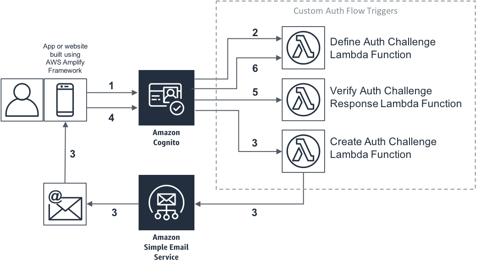

# Authentication

## Overview

This package implements passworless authentication with Amazon Cognito.

1. The user enters their email address in the App.
1. The user pool calls the “Define Auth Challenge" [Lambda function](src/challenge/lampbda.ts). This Lambda function determines which custom challenge needs to be created.
1. The user pool calls the “Create Auth Challenge” [Lambda function](src/challenge/lampbda.ts). This Lambda function generates a secret login code and mails it to the user by using Amazon SES.
1. The user retrieves the secret login code from their mailbox and enters it on the custom sign-in page, which sends it to the user pool.
1. The user pool calls the “Verify Auth Challenge Response” [Lambda function](src/challenge/lampbda.ts). This Lambda function verifies the code that the user entered.
1. The user pool calls the “Define Auth Challenge” [Lambda function](src/challenge/lampbda.ts). This Lambda function verifies that the challenge has been successfully answered and that no further challenge is needed. It includes “issueTokens: true” in its response to the user pool. The user pool now considers the user to be authenticated, and sends the user valid JSON Web Tokens (JWTs).

For a quick guide visit [Amazon Documentation](https://aws.amazon.com/blogs/mobile/implementing-passwordless-email-authentication-with-amazon-cognito/).

## Services

- Lambda
- SES to distribute e-mails
- RDS as user repository

## Deployment

- `npx serverless deploy`
